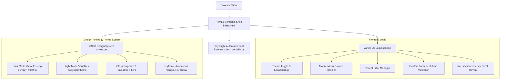

# Portfolio Website Architecture & Design System
**Candidate**: Ronit Kr. Roy | **Portfolio Target**: SDET & QA Automation Lead

---

## 1. System Design Overview



---

## 2. Technical Component Breakdown

### A. Theme Engine (`script.js` & `styles.css`)
- **Mechanism**: Toggles class `.light-theme` on `document.body`.
- **CSS Custom Properties**:
  ```css
  :root {
      --bg-primary: #0b0f17;
      --text-primary: #f3f4f6;
      --accent-primary: #6366f1;
      --accent-secondary: #06b6d4;
  }
  body.light-theme {
      --bg-primary: #f8fafc;
      --text-primary: #0f172a;
  }
  ```
- **Persistence**: Saved via `localStorage.setItem('theme', 'light' | 'dark')` and reloaded on `DOMContentLoaded`.

### B. Dynamic Project Filter
- Filter buttons specify `data-filter` (`all`, `qa`, `fullstack`).
- Detailed project cards specify `data-category` (`qa` or `fullstack`).
- When a filter button is clicked:
  1. Active state CSS class moves to selected button.
  2. JS iterates cards and adds/removes `.hidden` CSS utility class (`display: none !important; opacity: 0;`).

### C. Client-Side Form Validation
- Standard submission default prevented via `e.preventDefault()`.
- Validates:
  - Name: Non-empty trimmed string.
  - Email: Standard Regex pattern `/^[^\s@]+@[^\s@]+\.[^\s@]+$/`.
  - Message: Non-empty trimmed string.
- Error Handling: Applies `.invalid` to `.form-group` which displays red border and reveals `.error-msg`. Real-time clearing attached to `input` event listener.
- Success Banner: Displays `#form-status-banner` flex container for 5 seconds upon valid submission.

### D. Scroll Reveal Animation Engine
- Utilizes `IntersectionObserver` observing all `.reveal` nodes.
- When an element enters 10% threshold of the viewport, `.active` class is added, applying smooth translateY transition (`opacity: 1; transform: translateY(0)`).
- Once revealed, observer unobserves the element to save memory.

---

## 3. Automated Test Suite Architecture (`tests/test_portfolio.py`)

The portfolio includes an automated test framework written in Python using **Playwright** and **Pytest**.

### Test Suite Structure
```
tests/
├── conftest.py          # Fixtures: target_url, desktop_page (1280x800), mobile_page (390x844)
├── test_portfolio.py    # Test cases covering functional, responsive, and accessibility scenarios
└── test_temp.py         # Sandbox test script
```

### Key Fixtures in `conftest.py`
```python
@pytest.fixture
def desktop_page(page: Page, target_url: str) -> Page:
    page.set_viewport_size({"width": 1280, "height": 800})
    page.goto(target_url, wait_until="domcontentloaded")
    return page
```

### Covered Test Cases Matrix
- **TC-F01 to TC-F04**: Smooth Scrolling & Section Anchor Navigation.
- **TC-F05 & TC-F06**: Project Filter toggles (QA, Full-stack, All) & Card Visibility Count.
- **TC-F07 & TC-F08**: Dark / Light Theme toggle & LocalStorage persistence.
- **TC-F09 to TC-F12**: Contact Form Validation (Required fields, invalid email format, success banner display).
- **TC-M01 & TC-M02**: Mobile Viewport Drawer Menu opening/closing behavior.
- **TC-A01 & TC-A02**: HTML5 Semantic Landmarks (`nav`, `main`, `footer`) accessibility checks.

---
*Documentation stored in `doc/PORTFOLIO_SYSTEM_ARCHITECTURE.md` for Ronit Kr. Roy's portfolio.*
